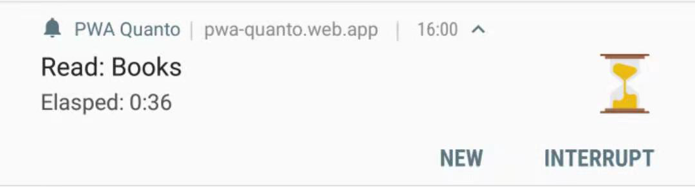

## Notes

- Prior experiences with React, Redux, and Progressive Web App required
- Some PWA features still have limited support on certain platforms/with certain browsers

## The Challenge

While working on my [Quanto Time Tracker](/portfolio/pwa-quanto), I envisioned a feature that enables the user, without opening the app, to both view the category, start time, and elasped time of the currently tracked activity as well as to engage with the app like starting a new activity or interrupting/resuming the current activity.

While this may at first sound like a feature from a native app, it's actually achievable(at least on Android) through pure front-end web technology in a Progressive Web App.

For those of you who aren't yet familar with the topic, Progressive web apps use modern web APIs along with traditional progressive enhancement strategy to create cross-platform web applications. These apps work everywhere(desktop/mobile) and provide several features that give them the same user experience advantages as native apps.

Some of these native features that a PWA provide, like offline use, push notificaiton, and background sync are achieved with the help of the service worker, a JavaScript file that operates separately from the main browser thread. The service worker, specifically, sending re-engagable notifications through the service worker, as well as handling engagement actions in the service worker and then in the main app thread, will be the focal point of today's blog post, which includes the following topics:

- Show actionable notifications (after first acquiring the necessary permission)
- Handle notification actions in the service worker
- Have the service worker communicate the action to the main brower thread where the main app runs
- Listen to the service worker communication in the main app and trigger a Redux action
- Or listen to the service worker communication in the main app and trigger a React Context API action (alternative to Redux)

## My Approach & Solution

##### Show actionable notifications (after first acquiring the necessary permission)

Firstly, I have a simple switch component which when clicked prompt the user to give permission to the app to display notifications. I consider it a better practice than immediatly prompting for permission out of nowhere. Once permission is given, the switch will be disabled. I'd also add some text to explain what sort of notification is in store for the user in a real-life scenario.

```jsx
const NotificationSettings = () => {
  const [notificationEnabled, setNotificationEnabled] = useState(
    Notification.permission === "granted" ? true : false
  )
  const handlePermissionRequestClick = () => {
    Notification.requestPermission(result => {
      if (result === "granted") {
        setNotificationEnabled(true)
      }
    })
  }
  return (
    <Switch
      onChange={handlePermissionRequestClick}
      checked={notificationEnabled}
      disabled={notificationEnabled}
    />
  )
}
```

---

Next comes a Redux (or React Context API) action type to actually display the notification.

```javascript
case DISPLAY_NOTIFICATION:
  if (Notification.permission === "granted") { // sanity check for permission again
    if ("serviceWorker" in navigator) { // check for service worker since notification reply on it
      var options = {
        body: "notification body message",
        timestamp: new Date(), // time shown in the notification, needs to be a JS date object
        icon: "android-chrome-192x192.png", // icon shown in the notification
        // you can customize the notification more with fields like "badge", "image", etc.
        actions: [
          {
            action: "new",
            title: "New"
          },
          {
            action: "pause",
            title: "Pause"
          }
        ], // essense of the re-engagable notification with two actions defined
        tag: "default", // makes any new notification automatically replace the old one with the same tag, so there will always be one notification of this tag shown at any given time
        silent: true // show the notification without vibrating the device or playing any sound
      };

      navigator.serviceWorker.ready.then(swreg => { // get the service worker instance and call its showNotification method
        return swreg.showNotification(
          "notification title message",
          options
        );
      });
    }
  }
  return state;
```

With the DISPLAY_NOTIFICATION action type in place, I can just dispatch the corresponding action whenever I want to display or update the notification.

##### Handle notification actions in the service worker

##### Have the service worker communicate the action to the main brower thread where the PWA runs

Then, we come to the actual servicer worker file:

```javascript
// listen for interaction with notification
self.addEventListener(
  "notificationclick",
  e => {
    const channel = new BroadcastChannel("service-worker-channel")
    if (e.action === "new") channel.postMessage("new")
    if (e.action === "pause") channel.postMessage("pause")
    channel.close()
  },
  false
)
```

Two things are accomplished here, the one is the listening of clicks on the two notification actions defined just above. The other is to send the action info to the main browser thread where the app runs with the BroadcastChannel API. One can manually add this part of code to the service worker file generated in the build process(of create-react-app, or equivalent tools), or better yet, use workbox to automate the injection during the build process. The use of workbox to customize the service worker is another interesting topic, but its scope rightly justifies a blog post of its own, and I apologize for its omission here.

Again, the need to use the BroadcastChannel API is a result of the service worker running in a seperate thread. One way for it to communicate with the main app is through the BroadcastChannel API. Of course, there are other ways to produce a similar effect like `client.postMessage()`, however, in this case I prefer the BroadcastChannel due to its simplicity--just create a channel instance, send the message, and close the channel.

##### Listen to the service worker communication in the main app and trigger a Redux action

```javascript
// index.js
const channel = new BroadcastChannel("service-worker-channel")
channel.onmessage = msg => {
  if (msg.data === "new") store.dispatch(newActivity())
  if (msg.data === "pause") store.dispatch(puaseActivity())
}
channel.close()
```

I put this block in the index.js file after the `store` is created with `createStore(someReducer)`, and before `<Provider store={store}>`. It listens to messages sent from the service worker on the BroadcastChannel, and then directly dispatches a corresponding redux action, thereby allowing the user to interact with the app outside the app by clicking on a notification action, either from the notification bar or the lockscreen.

If you are using Redux to manage the state, you can skip the next, and last part of the blog which deals with React Context API as the state manager instead.

##### Listen to the service worker communication in the main app and trigger a React Context API action

If you are an early adopter who uses React Context API to manage your state, or have just switched to Context from Redux as an experiment like me, the above method won't work for you, because you can't dispatch a Context action in the index.js, out of the scope of React, and by extension any React Context.

This problem can be easily addressed by moving the above code block in index.js into any component that has access to the necessary Context or even into the Context itself. One catch to this, however, is that you must wrap the block in a `useEffect()` hook to make it only run once after the component is first mounted, otherwise you'll run into the annoying bug of receiving more messages in the app than the service worker actually sends.

```jsx
// someContext.js or someComponentWithContextAccess.js
useEffect(() => {
  const channel = new BroadcastChannel("service-worker-channel")
  channel.onmessage = msg => {
    if (msg.data === "new") dispatch({ type: "ADD_ACTIVITY" })
    if (msg.data === "interrupt") dispatch({ type: "INTERRUPT_ACTIVITY" })
  }
  return channel.close // code in return will run before the component unmounts
}, [dispatch]) // having nothing but dispatch in this array makes useEffect() work like componentDidMount
```

`useEffect()` can be substituted by a pair of `componentDidMount` and `componentWillUnmount()` to achieve a similar result if you have a class component.

That concludes my blog post. Thank you for your time!
