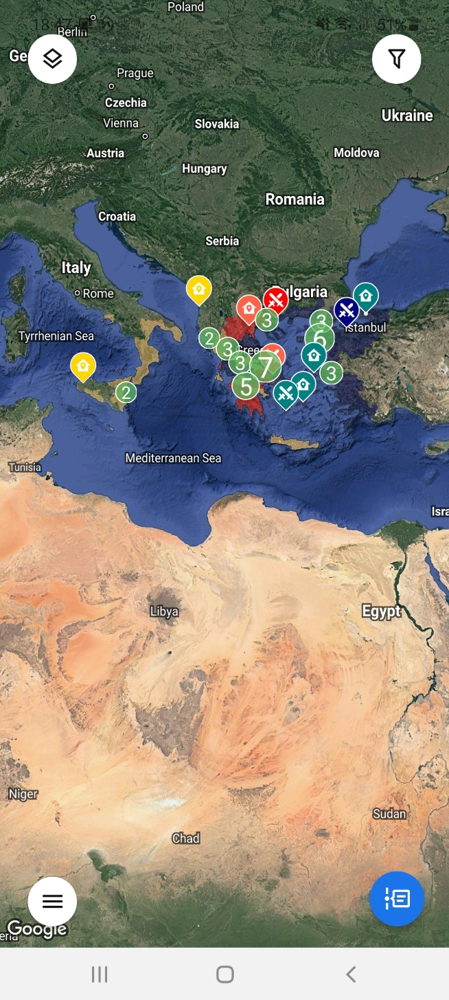
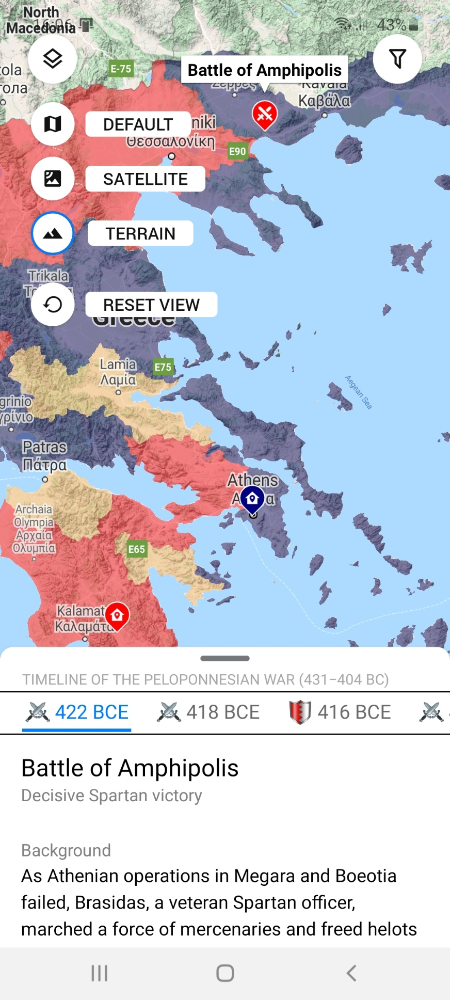
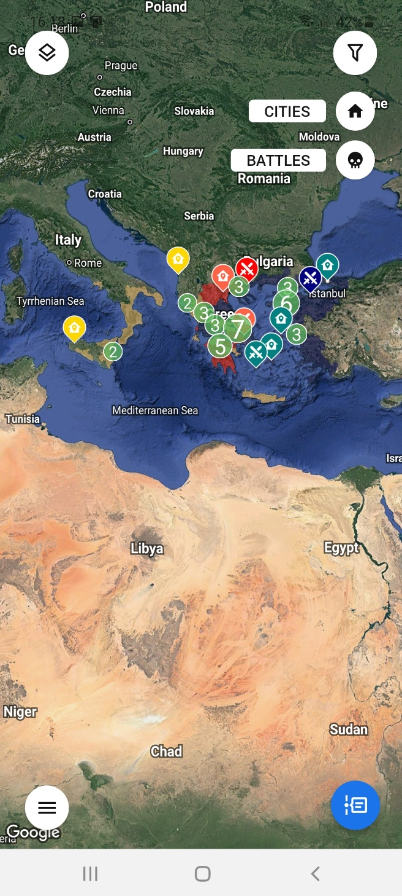
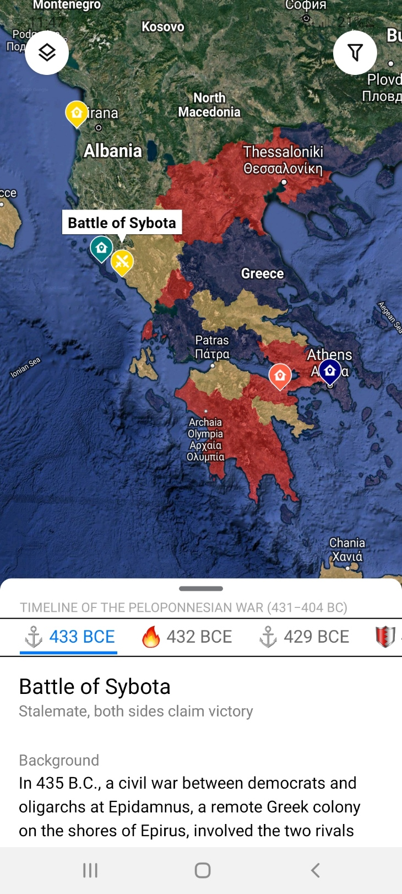
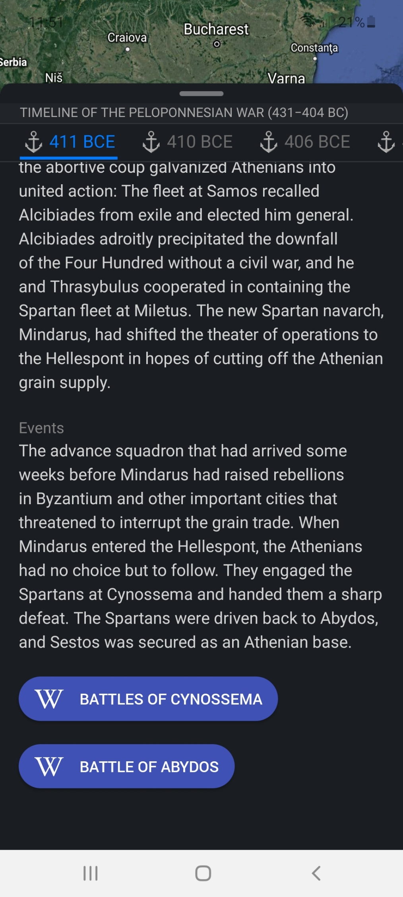
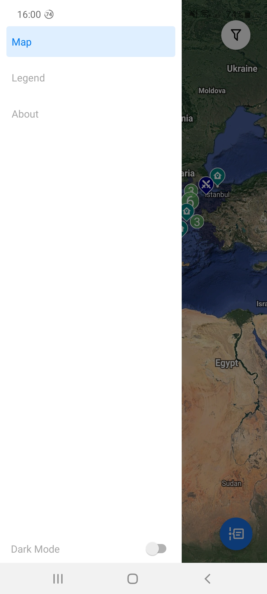
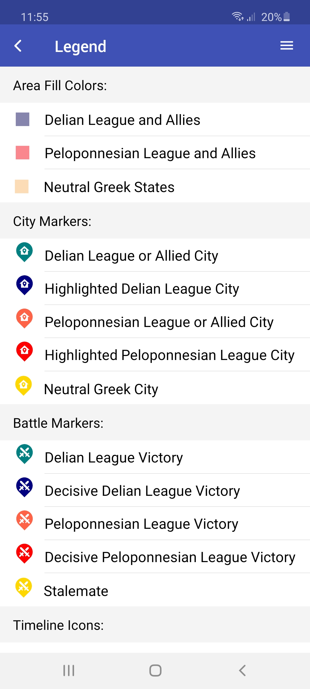
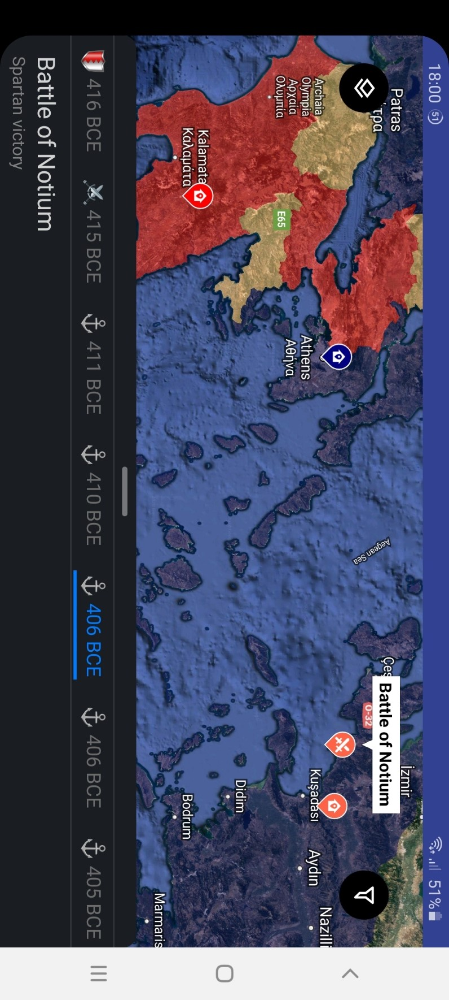

# Biao! StoryMap

Biao! is a free app to help people follow stories that highlight the locations of a series of events.

## Table of Contents

- [Installation](#installation)
- [Usage](#usage)
- [Floating Buttons](#floating-buttons)
  - [Map Type Switch](#map-type-switch)
  - [Map Marker Filter](#map-marker-filter)
  - [Timeline View](#timeline-view)
  - [Open Drawer Menu](#open-drawer-menu)
- [Drawer Menu](#drawer-menu)
  - [Map View](#map-view)
  - [Legend View](#legend-view)
  - [About View](#about-view)
  - [Dark Mode switch](#dark-mode-switch)
- [Other Features](#other-features)
- [Roadmap](#roadmap)
- [Libraries](#libraries)
- [Contributing](#contributing)
- [License](#license)

## Installation

Fork and clone the repository, then run:

```bash
# npm
npm install
```

## Usage

For development, run:

```bash
# npm
expo start
```

For production, run:

```bash
# npm
expo build:android
# or
expo build:ios
```

### Floating Buttons


The 4 floating buttons on the map screen, in clockwise from the top-left, are:

#### Map Type Switch

Same map types as in Google Maps:

- Roadmap view
- Satellite view
- Terrain view
- Reset map viewpoint to default



#### Map Marker Filter

Show / hide types of markers on map

- City Marker Filter
- Battle Marker Filter



#### Open Timeline Modal



- Click on a date to jump to the associated event, swipe on the date bar to jump to an earlier or later time range
- Swipe left or right on the content to view the previous or next event
- Drag the handle up / down to enter / exit full screen reading mode



### Open Drawer Menu



#### Map View

#### Legend View



#### About View

#### Dark Mode switch

turn on / off dark mode


## Other features

- Map marker clustering


- Landscape mode



## Roadmap

- More events
- Move data to cloud
- Dynamic area coloring based on timeline
- Marching (& sailing) routes on maps
- Add tourist attractions
- More accurate area coloring for factions

## Libraries

Third-party projects that helped

- [expo](https://github.com/expo/expo)
- [redux](https://github.com/reduxjs/redux)
- [@react-navigation](https://github.com/react-navigation/react-navigation)
- [react-native-maps](https://github.com/react-native-community/react-native-maps)
- [react-native-modalize](https://github.com/jeremybarbet/react-native-modalize)
- [react-native-tab-view](https://github.com/react-native-community/react-native-tab-view)
- [react-native-map-clustering](https://github.com/venits/react-native-map-clustering)
- [native-base](https://github.com/GeekyAnts/NativeBase)

## Contributing

Pull requests are welcome. For major changes, please open an issue first to discuss what you would like to change.

## License

[GNU General Public License v3.0](https://choosealicense.com/licenses/gpl-3.0/)
