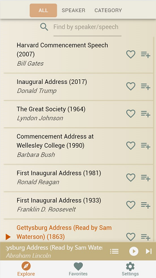
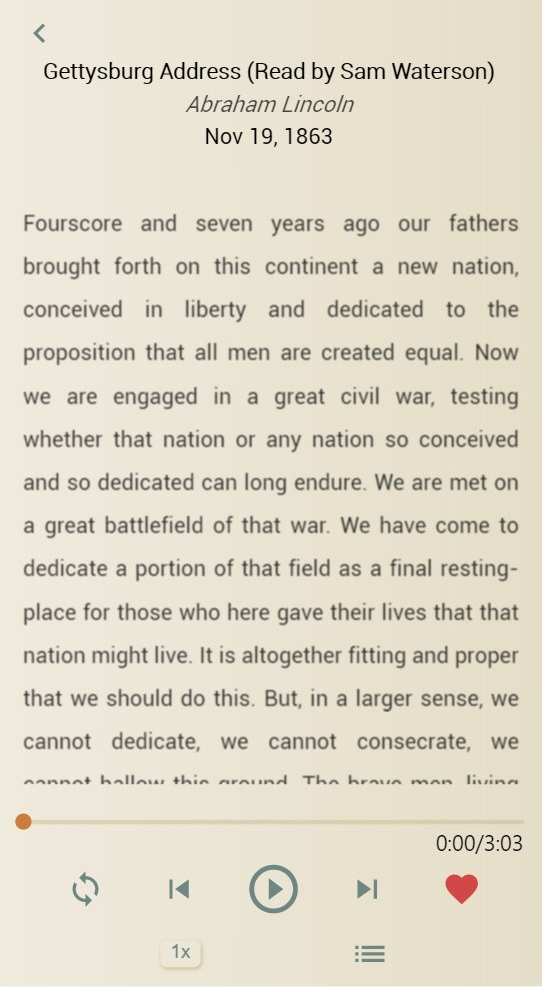
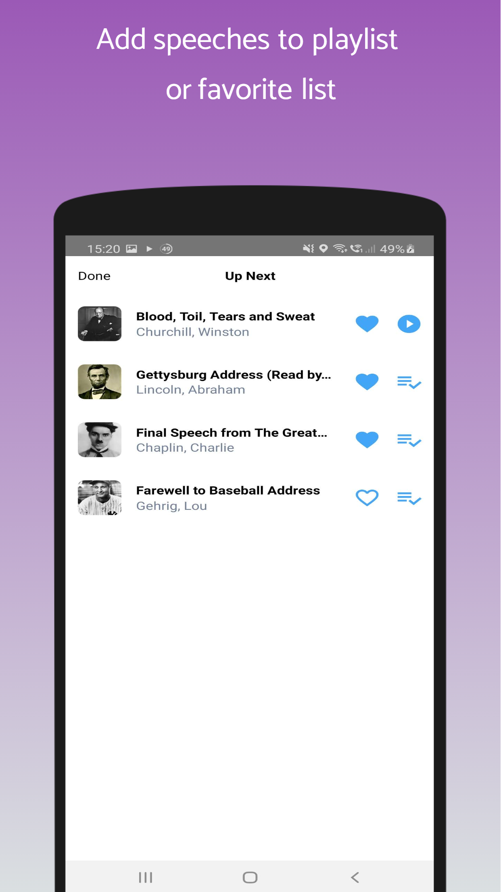
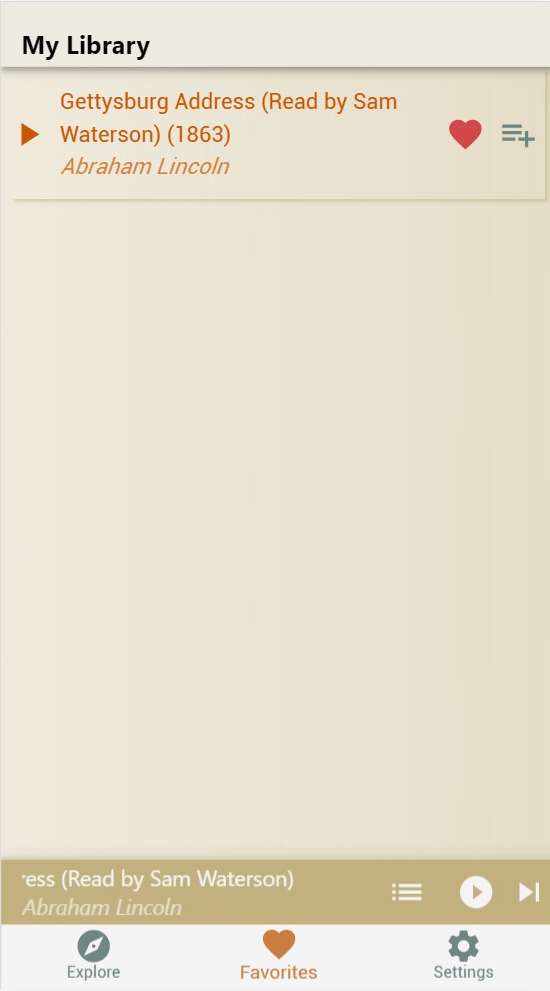
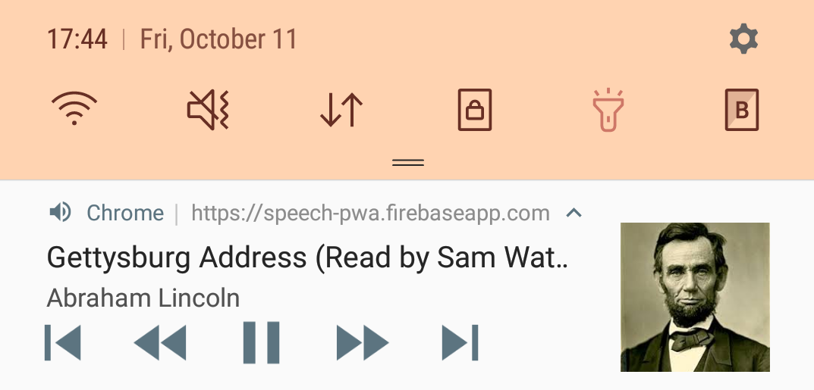
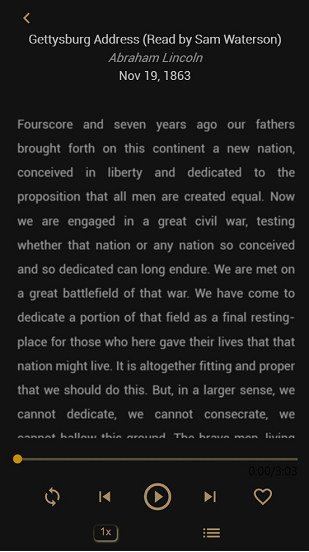

## Table of Contents

- [Introduction](#introduction)
- [Speeches Views](#speeches-views)
- [Playing Bar](#playing-bar)
- [Script Views](#script-views)
- [Playlist Views](#playlist-views)
- [Favorites Views](#favorites-views)
- [Notification Controls](#notification-controls)
- [Dark Mode](#dark-mode)
- [Acknowledgment](#acknowledgment)

## Introduction

The Eloqua app offers, in both audio and text, great speeches in history from 30+ public figures, including politicians, entrepreneurs, authors, celebrities, etc., covering a wide range of themes.

## Speeches View

Find a speech by its speaker, theme or do a keyword search, click on title to play it or add it to playlist queue or favorites list.

## Playing Bar

Skip Next, Pause/Resume, Go to Playlist, or View Speech Script from the Playing Bar which is present most of the times.

## Script View

Click the title area of the playing bar to view the script text of currently playing speech.
Extended control features like loop toggle and playback speed switch are also in this view.

## Playlist View:

Showing the queued speeches to be played.
You can remove any/all speech(es) from the playlist or add one/all to the favorites list.

## Favorites View:

List of your favorite speeches list for easier access.

## Notification Controls

View, play/resume, rewind/fast forward, go to previous/next from the notification bar or even lockscreen of your smartphone with Eloqua running in background.

## Dark Mode:

Don’t forget to take better care of your eyes. Toggle dark mode in the Settings View for the optimal bedtime reading experience.

## Acknowledgment

Eloqua is a collaborative effort between myself, as creator-director-senior developer, and my protégée, as junior developer [Layla](https://github.com/laylapku/).

##### Libraries

- [react](https://github.com/facebook/react/)
- [react-player](https://github.com/facebook/react/)
- [material-ui](https://github.com/mui-org/material-ui)
- [redux](https://github.com/reduxjs/redux)
