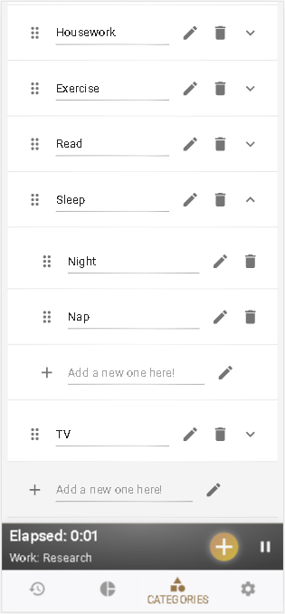
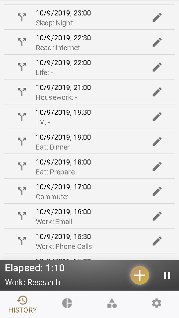
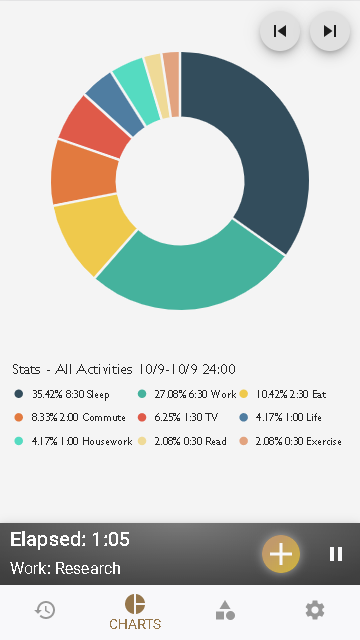

### Table of Contents

- [Introduction](#introduction)
- [Main Views](#main-views)
- [First Time Usage and Categories View](#first-time-usage-and-categories-view)
- [Current Activity Bar](#current-activity-bar)
- [History View](#history-view)
- [Charts View](#charts-view)
- [Categories View](#categories-view)
- [Settings View](#settings-view)

### Introduction

Improve your productively or life style by analysing how you spend your time.

- Show your boss (maybe you) why it's hard to get work done on that project.
- With your crazy schedule are you getting enough sleep?
- How is your balance of work and family?

### Main Views

- History view.
- Charts (& statistics) view.
- Categories View
- Settings view.

Switching between the 4 main views is done by tapping one of the bottom navigation bar icons.

### First Time Usage and Categories View

We recommend that you customize your list of activities before staring to track your time with PWA Quanto.
The list of activity names that you use will depend on what aspect of you life you are analysing. PWA Quanto installs with a default set of activity and detail names. By customizing the lists you can get the most out of the application.

In "Categories" View, you can customize both the list of activity names and the seperate lists of detail names associated with each activity name. Either add new activity/detail names to the list from the respective input fields, delete current activities/details, or change their order by simply draging them around.

Tip: Place more frequently used categories towards the top of the list to speed up creation of new activities.

Note: Changing the names in this categories list does not affect existing activity history.

### Current Activity Bar

This bar is present at all times and displays the current activity.

Tap the Start New Activity toolbar button to finish the current activity and start a new one.

Tap the Interrupt toolbar icon to start the activity interrupt timer. Tap the Resume toolbar icon when the interrupt is over.

###### Interrupt Activity

It is not uncommon to have a longer duration activity interrupted. For example, a phone call might interrupt the review of a long document. Recording these interruptions may help in analysing your productivity.

One way to capture the interruption would be to start a new activity, and when the interruption was done, start another new activity resetting the original activity name and detail.

PWA Quanto has a shortcut to accomplish this sequence of steps. Tap the Interrupt icon on the "Current Activity" bar when an activity is interrupted. The original interrupted activity will be finished, and a new activity will be added for the interruption. When the interrupt is done simply tap the Interrupt icon again, a new activity will be started with the same activity name and detail as the original interrupted activity.

Tip: If the interrupt was started by accident, or does not last long enough to matter, delete the interruption activity.

### History View

This view is used to review the sequence of past activities. The start time and date of each activity is shown.

In addition to changing an activity using the details dialog you can delete or split an activity.

###### Edit Activity

This dialog shows the details of a single activity. You can change the activity and details selections. You can also change the start and finish times. When you change the start or finish times the activities that precede or follow the activity are updated so that there is no gap or overlap.

###### Split Activity

This dialog is used to split an activity into two activities. The split at time will be used to set the end time of the first activity and the start time of the second activity. After the activity has been split you can change the activity names to reflect what was done during each time period.

### Charts View

This view displays the total time in minutes and percentage of each activity and also the statistics in the form of a pie chart.

If you tap on a segment when viewing All Activities the view will drill down into the details of that activity. If you tap on the chart when viewing the details the view will again show All Activities.

Use the application settings to restrict the activities used to generate the statistics to a single day or date range. The day or date range will be shown on the title and the next and previous buttons will be displayed on the toolbar. The next and previous buttons will move the date range by the length of the range.

If you want a view that shows how you spent your 'waking hours' use the settings to exclude activities that you name.

### Settings View

###### Sign In & Backup/Restore Data

You can backup/restore your activity history, custom categories, and settings to/from the cloud after you sign in.

###### Notification (Android Only)

By allowing PWA Quanto to send you notifications, you'll be able to check and pause/resume the current activity, or add a new activity without entering the app, from the notification bar or the lock screen.

###### Date Filter

You can limit the Charts (& Statistics) View to a day or date range of your choice here.

###### Keyword Filter

You can exclude certain activities from the Charts (& Statistics) View by adding their names as keywords here.

###### Purge History

The Purge command is used to remove old activity records from the database. When OK is tapped all activity records that finish on or before the date will be permanently deleted from the database.

You may want to backup the old activity information to the cloud before deleting it.

###### Default Categories

Restore to the default set of activity and detail names that PWA Quanto originally came with.

Note: All your customary category changes wil be undone.

### Limitations

- Timing is done with a resolution in minutes.
