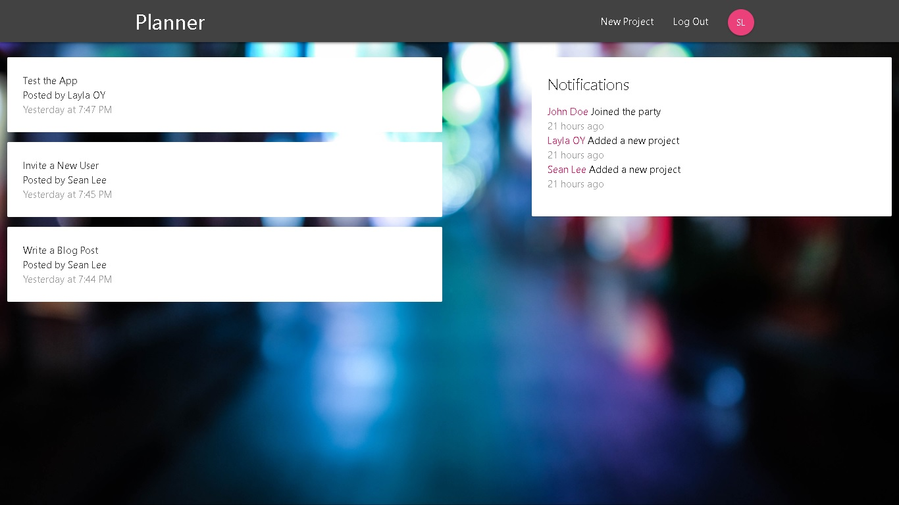

A mini full-stack project management tool built mainly around React, Redux and Firebase's serverless services, features include: 

- User sign up/in/out with Firebase Authentication
- Project creation for logged in users
- Notification for project/user creation with Firebase Functions
- User, project, and notification data stored real-time in Firebase Firestore
- Project deployed on Firebase Hosting for better synegy
