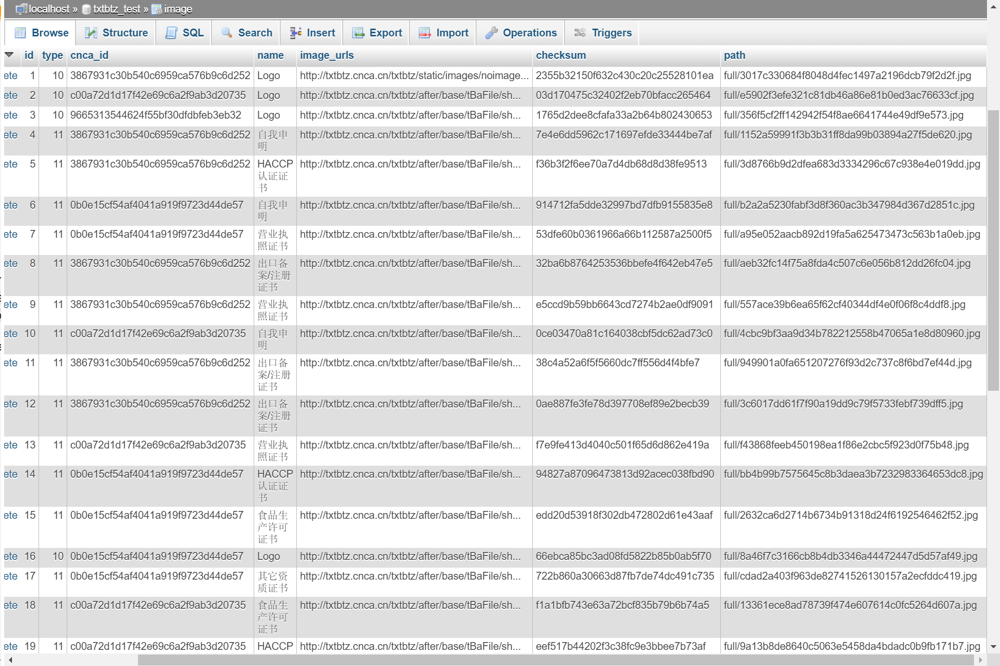
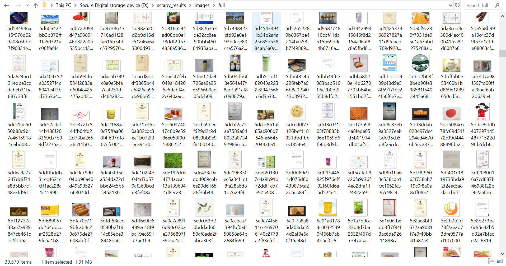
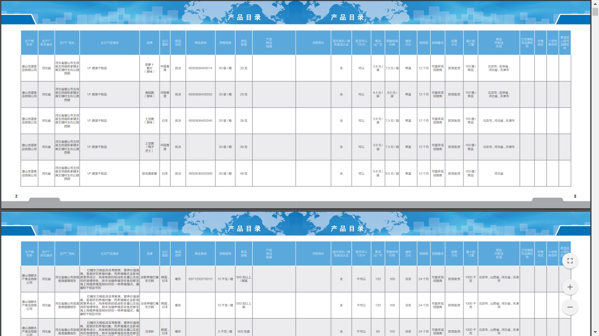

## Overview

Challenged myself to something I had almost no prior experience with (web scraping) but knew was possible, by accepting my first real coding contract job on a tight schedule. It felt a bit crazy at first, but everything began to fall into place once I started with researching and teaching myself the necessary pieces to the puzzle. The whole project turned out to be a great boost to my confidence which made me see myself working in a tech-related field a possibility.

## The Challenge

- No previous Python or web scraping experience
- A high number of data entries and media files to be scraped
- Multiple levels of one-to-many relationship data to be scraped
- The client wanted scraped data stored in a database for various future uses
- Target is a poorly coded government website with bad labeling for most of the data fields
- A tight schedule of one week

## Approach & Solution

Taught myself from scratch Python foundations and the web scraping framework Scrapy, chose MySQL as the database solution and reviewed relevant SQL syntaxes, divided the 4 different levels of information into 3 planned database tables and a media folder, mapped the messy parts of data with their relative(sometimes newly created) field names, coded and tested the scraping script with the desired data successfully scraped, all done within the narrow time frame of a week.

## Results

##### 2.5k \* Company Info scraped into a MySQL database table of companies

---

##### 10k \* Product Info scraped into a MySQL database table of products

---

##### 40k \* Image Info scraped into a MySQL database table of images

---

##### 40k \* Image Files scraped into a media folder

---

##### 66-page PDF of product listing data tables

